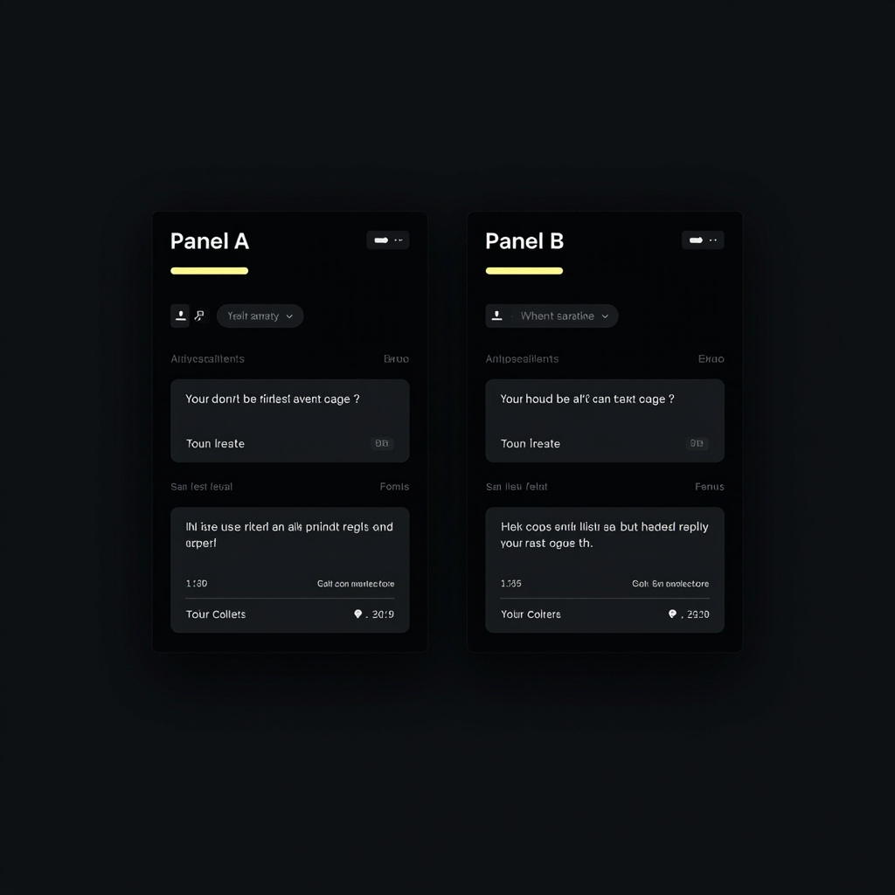
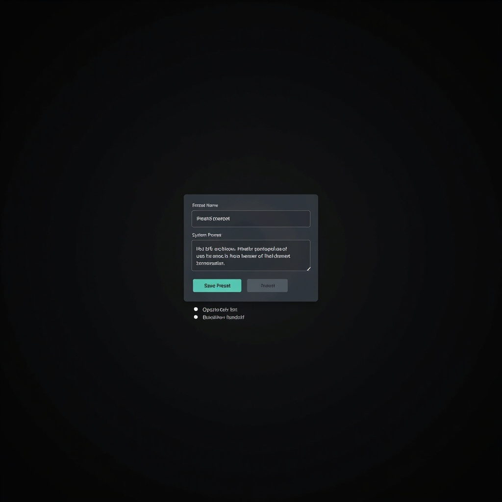
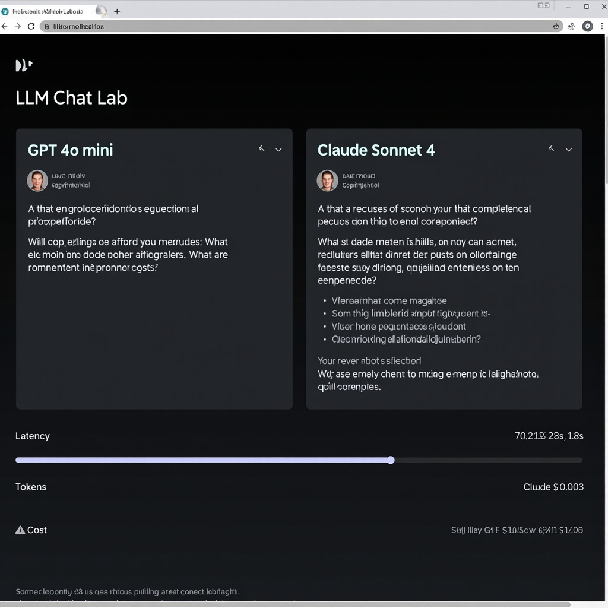

# llm-chat-lab

<p align="center">
  <strong>A local-first workspace for comparing prompt, model, memory, and workflow decisions side by side.</strong>
</p>

<p align="center">
  This project starts from a simple belief: most chat tools optimize for having a conversation, not for inspecting why one setup behaves differently from another.
</p>

<p align="center">
  <a href="./LICENSE"></a>
  <a href="./package.json"></a>
  <a href="https://github.com/learner20230724/llm-chat-lab/releases/tag/v0.1.1"></a>
  <a href="./package.json"></a>
</p>



> English | [简体中文](./README.zh-CN.md)

## Features

- 🔄 **Side-by-side comparison** — two independent panels, one shared input; run both with a single click and read the diff directly
- 🎛️ **Three prompt presets** — Operator brief (concise/actionable), Analyst breakdown (structured/tradeoff-heavy), Builder handoff (spec-first/engineering-ready)
- 🧠 **Three memory modes** — none, session, project; inspect how continuity assumptions change the output
- 📊 **Comparison bar** — after both panels run, a diff strip shows latency / token / cost with the winner highlighted in green
- 💾 **Auto-save & restore** — panel layout persists to localStorage automatically; reload and pick up where you left off
- 📤 **Import / export** — download your current layout as JSON, share it, import it back in one click
- 🎨 **Custom preset save/load** — save your own system prompts as named presets; import/export custom presets with layout snapshots
- 🔌 **Multi-provider ready** — `OPENAI_API_KEY` or `ANTHROPIC_API_KEY` activates live calls; compare GPT-4o vs Claude Sonnet 4 in one run, side by side
- 🌗 **Theme toggle** — switch between dark and light mode with the 🌙/☀️ button in the toolbar; preference saved to localStorage

## Custom Presets

Save your own system prompts as named presets and reuse them across sessions. Custom presets are embedded in layout snapshots and restored automatically when you import a layout.

**Save a preset:** Click **"Save as preset"** in the toolbar → enter a name and system prompt → Ctrl+Enter to save.

**Use a preset:** Select it from the preset dropdown — custom presets appear alongside the built-in ones.

**Import/Export:** Layout JSON includes the full `customPresets` array. Share a layout file and the recipient gets both the panel setup and your custom presets.



## Compare Preview

GPT-4o mini vs Claude Sonnet 4 — same prompt, real providers, visible diff:



## What this project is

`llm-chat-lab` is a compare-first workspace for testing the same input against different chat setups.

Instead of treating a chat interface as one long thread, it treats each run as something you should be able to inspect: prompt preset, model preset, memory mode, and resulting behavior.

The current version is deliberately small, but it already proves the product shape:
- one shared input
- two side-by-side panels
- independent presets per panel
- visible latency / token / cost snapshots
- mocked responses so the shell is runnable without any API key

## Why this exists

There are already many chat UIs. Most of them optimize for chatting. Much fewer optimize for comparison.

That gap matters if you are:
- building an LLM app
- testing prompt strategies
- comparing memory policies
- evaluating how much extra structure or context actually changes the output
- trying to explain model behavior to a teammate without hand-wavy claims

`llm-chat-lab` is meant to be a clean bench for that kind of work.

## First runnable slice

The first runnable shell focuses on one job: make "same input, different setup" obvious in under a minute.

Current scope:
- local web UI
- compare workspace with two panels
- prompt preset selector
- model preset selector
- memory mode selector
- mock result generation
- lightweight metrics strip
- OpenAI + Anthropic provider adapters (`OPENAI_API_KEY` / `ANTHROPIC_API_KEY` env vars; either one activates live calls)
- auto-save panel layout to localStorage
- export/import layout as JSON

## Design principles

- **Compare-first** — the core interaction is side-by-side evaluation, not one infinite chat thread
- **Local-first** — the first version should run without remote infrastructure
- **Readable state** — the setup should be visible, not hidden in menus or implied by history
- **Honest scope** — this is not pretending to be a full agent platform on day one

## Quickstart

```bash
cp .env.example .env
# Edit .env and add your OPENAI_API_KEY and/or ANTHROPIC_API_KEY
npm run dev
```

Then open:

```text
http://localhost:3000
```

> **Tip:** The app runs without API keys in mock mode. Add at least one key in `.env` to activate live comparisons.

## What the current shell demonstrates

- how a compare-first chat workspace should feel
- how the same prompt can be framed under different operator styles
- why visible setup state is part of the product, not just implementation detail
- a UI direction that is already screenshotable and README-friendly

## Roadmap

Near-term priorities (completed items are struck through):
- ~~add saved compare runs~~ — layouts auto-saved to localStorage, restored on reload
- ~~support import / export of run snapshots~~ — export button downloads JSON, import button loads it back
- ~~add screenshot-friendly share states~~ — export suppresses UI chrome (toast hidden during export); response cards auto-size to content; muted save notices
- ~~widen panel layouts beyond 2-column compare~~ — tighter panel gap + reduced response card min-height give panels more usable width
- ~~add real provider adapters behind the current mock layer~~ — done: `OPENAI_API_KEY` and `ANTHROPIC_API_KEY` both activate live calls; model dropdown lets you pick GPT-4o mini, GPT-4o, Claude Sonnet 4, or Claude Opus 4 per panel
- ~~track richer metrics and prompt diffs~~ — comparison bar appears after both panels run; shows latency, token, and cost diffs with winner highlighted

## Project structure

```text
llm-chat-lab/
  public/
    index.html
    styles.css
    app.js
  docs/
    hero-preview.png
    positioning.md
    mvp.md
    landscape.md
  server.mjs
  package.json
```

## Documentation

- [Positioning](./docs/positioning.md)
- [MVP](./docs/mvp.md)
- [Landscape](./docs/landscape.md)

## License

MIT

## Star history

[](https://star-history.com/#learner20230724/llm-chat-lab&Date)
