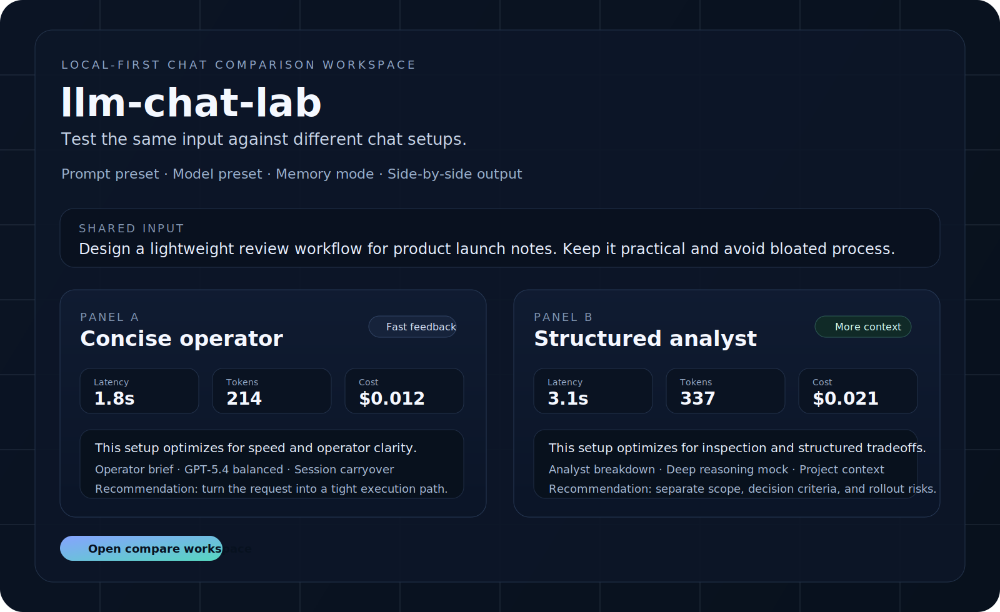

# llm-chat-lab

<p align="center">
  <strong>一个本地优先的聊天实验工作台，用来并排比较 prompt、模型、记忆和工作流策略。</strong>
</p>

<p align="center">
  这个项目从一个很简单的判断出发：大多数聊天产品优化的是“聊起来顺不顺”，不是“为什么这个配置和那个配置表现不同”。
</p>

<p align="center">
  <a href="./LICENSE"></a>
  <a href="./package.json"></a>
  <a href="./package.json"></a>
</p>



> [English](./README.md) | 简体中文

## 这是什么

`llm-chat-lab` 是一个 compare-first 的聊天工作台，用来测试同一段输入在不同配置下会怎么表现。

它不把聊天界面当成一条无限延长的对话线程，而是把每次运行都当成可以被审视的实验：prompt preset、model preset、memory mode，以及最后生成出来的行为差异，都应该是可见的。

当前版本刻意收得很小，但产品形态已经成立：
- 一个共享输入框
- 两个并排比较面板
- 每个面板独立配置 preset
- 可见的 latency / token / cost 快照
- 本地 mock 响应，让壳子在接真实 provider 之前就能先跑起来

## 为什么做这个

聊天 UI 已经很多了，但大多数都在优化“聊天”。真正把“比较”当主任务的并不多。

这个空位对下面这些人其实很重要：
- 在做 LLM 应用的人
- 在试 prompt 策略的人
- 在比较不同 memory policy 的人
- 想判断更多结构和上下文到底有没有带来输出变化的人
- 想把模型行为讲清楚给团队，而不是只说感觉的人

`llm-chat-lab` 想做的，就是这样一张干净的实验台。

## 第一版可运行壳子

第一版的目标很明确：让人打开后，在一分钟内理解“同一输入，不同配置”的价值。

当前范围：
- 本地 web UI
- 双面板 compare workspace
- prompt preset selector
- model preset selector
- memory mode selector
- mock 结果生成
- 轻量 metrics strip
- 不依赖后端、不需要账号、不需要 provider 配置

## 设计原则

- **Compare-first**：核心交互是并排评估，不是一条无限长聊天记录
- **Local-first**：第一版默认本地可跑，不先引入远程基础设施
- **Readable state**：配置状态必须是可见的，而不是藏在菜单里或被历史上下文隐式吞掉
- **Honest scope**：不假装自己第一天就是完整 agent 平台

## 快速开始

```bash
npm install
npm run dev
```

然后打开：

```text
http://localhost:4173
```

## 这一版壳子已经证明了什么

- compare-first 的聊天工作台应该是什么手感
- 同一输入在不同 operator style 下应该如何呈现差异
- 为什么“可见配置”本身就是产品的一部分，而不只是实现细节
- 一个已经能截图、能放进 README 首屏的 UI 方向

## 路线图

接下来优先做这些：
- 保存 compare runs
- 支持运行快照导入导出
- 在当前 mock 层后面接真实 provider adapters
- 增加适合截图和分享的 share state
- 把布局从 2-column compare 扩到更多形态
- 记录更丰富的 metrics 和 prompt diff

## 项目结构

```text
llm-chat-lab/
  public/
    index.html
    styles.css
    app.js
  docs/
    hero-preview.svg
    positioning.md
    mvp.md
    landscape.md
  server.mjs
  package.json
```

## 从成熟开源项目 README 借什么

这次 README 的写法会刻意借鉴那些成熟项目常见的结构：
- 顶部先有一句清楚的定位
- badge 保持克制，不做信息噪音
- 首屏要立刻看到视觉资产
- 先快速说清 “what this is”，再进入展开说明
- quickstart 要短，确保能马上跑起来
- roadmap 和边界要写得诚实，不用夸张 AI 话术

这个仓库也会按这个方向写：更像真实产品项目，而不是 demo 说明文。

## 文档

- [Positioning](./docs/positioning.md)
- [MVP](./docs/mvp.md)
- [Landscape](./docs/landscape.md)
- [README Benchmark Notes](./docs/readme-benchmark-notes.md)

## License

MIT
