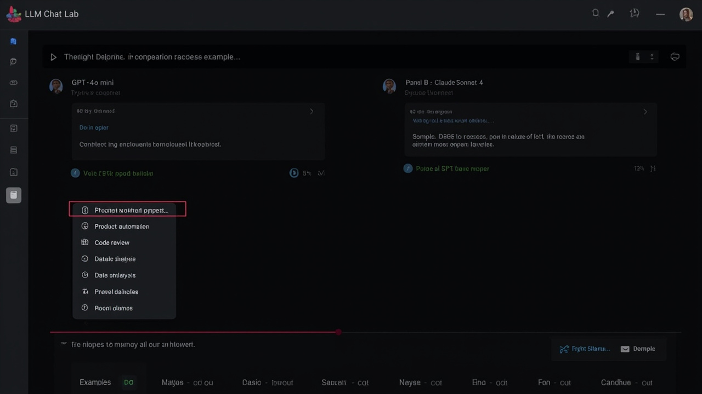

# llm-chat-lab

<p align="center">
  <strong>一个本地优先的聊天实验工作台，用来并排比较 prompt、模型、记忆和工作流策略。</strong>
</p>

<p align="center">
  这个项目从一个很简单的判断出发：大多数聊天产品优化的是"聊起来顺不顺"，不是"为什么这个配置和那个配置表现不同"。
</p>

<p align="center">
  <a href="./LICENSE"></a>
  <a href="./package.json"></a>
  <a href="https://github.com/learner20230724/llm-chat-lab/releases/tag/v0.1.5"></a>
  <a href="./package.json"></a>
  <a href="https://learner20230724.github.io/llm-chat-lab/docs/app/"></a>
</p>


> [English](./README.md) | 简体中文

## 这是什么

`llm-chat-lab` 是一个 compare-first 的聊天工作台，用来测试同一段输入在不同配置下会怎么表现。

它不把聊天界面当成一条无限延长的对话线程，而是把每次运行都当成可以被审视的实验：prompt preset、model preset、memory mode，以及最后生成出来的行为差异，都应该是可见的。

当前版本刻意收得很小，但产品形态已经成立：
- 一个共享输入框
- 两个并排比较面板
- 每个面板独立配置 preset
- 可见的 latency / token / cost 快照
- 本地 mock 响应，不设任何 API key 也能跑起来

## 键盘快捷键

工作区顶部有**快捷键提示栏**，实时显示所有可用快捷键。完整参考：

| 快捷键 | 功能 |
|---|---|
| `Ctrl+K` / `Cmd+K` | 聚焦提示词输入框 |
| `Ctrl+Enter` / `Cmd+Enter` | 运行对比（输入框内） |
| `Ctrl+S` / `Cmd+S` | 导出当前布局 |
| `Escape` | 取消聚焦输入框 |

## 自定义 Preset

将你自己的 system prompt 保存为命名 preset，随时复用。自定义 preset 会嵌入 layout 快照，导入时自动恢复。

**保存 preset：** 点击工具栏 **"Save as preset"** → 输入名称和 system prompt → Ctrl+Enter 保存。

**使用 preset：** 从 preset 下拉框中选择 — 自定义 preset 与内置 preset 并排显示。

**导入/导出：** Layout JSON 包含完整的 `customPresets` 数组。分享 layout 文件后，接收者会同时获得面板配置和你自定义的 preset。


## 对比效果预览

GPT-4o mini vs Claude Sonnet 4 — 同一段 prompt，真实 API，可视化 diff：


## 🌗 主题切换

使用工具栏中的 ☀️/🌙 按钮即可在明暗主题之间切换。主题偏好自动保存到 localStorage。

浅色模式：



深色模式（默认）：


## 📋 示例对比

工作台打开时会预载一个示例，第一次访问即可看到 UI 效果。使用工具栏中的 **📋 试试示例…** 下拉框可以切换：

| 示例 | 左面板 | 右面板 | 演示内容 |
|---|---|---|---|
| 产品工作流 | GPT-4o mini / Operator | Claude Sonnet 4 / Analyst | 两种风格如何框架化上线通知工作流 |
| 代码评审 | GPT-4o / Builder | Claude Opus 4 / Operator | Builder 规范 vs Operator 简洁指令 |
| 数据分析 | Claude Sonnet 4 / Analyst | GPT-4o / Builder | 结构化分析 vs 工程交接式分析 |
| 根因分析 | GPT-4o mini / Operator | Claude Sonnet 4 / Analyst | 简洁 vs 结构化：503 故障排查 |

每个示例会自动配置两侧的 preset 和模型，点击 **Run compare** 即可看到对比效果。


## 为什么做这个

聊天 UI 已经很多了，但大多数都在优化"聊天"。真正把"比较"当主任务的并不多。

这个空位对下面这些人其实很重要：
- 在做 LLM 应用的人
- 在试 prompt 策略的人
- 在比较不同 memory policy 的人
- 想判断更多结构和上下文到底有没有带来输出变化的人
- 想把模型行为讲清楚给团队，而不是只说感觉的人

`llm-chat-lab` 想做的，就是这样一张干净的实验台。

## 第一版可运行壳子

第一版的目标很明确：让人打开后，在一分钟内理解"同一输入，不同配置"的价值。

当前范围：
- 本地 web UI
- 双面板 compare workspace
- prompt preset selector
- model preset selector
- memory mode selector
- mock 结果生成
- 轻量 metrics strip
- OpenAI + Anthropic provider adapters（设 `OPENAI_API_KEY` 或 `ANTHROPIC_API_KEY` 环境变量即走真实调用）
- 面板布局自动保存到 localStorage，重载后恢复
- 导出/导入布局为 JSON 文件

## 设计原则

- **Compare-first**：核心交互是并排评估，不是一条无限长聊天记录
- **Local-first**：第一版默认本地可跑，不先引入远程基础设施
- **Readable state**：配置状态必须是可见的，而不是藏在菜单里或被历史上下文隐式吞掉
- **Honest scope**：不假装自己第一天就是完整 agent 平台

## 快速开始

```bash
npm install
npm run dev
```

然后打开：

```text
http://localhost:4173
```

## 这一版壳子已经证明了什么

- compare-first 的聊天工作台应该是什么手感
- 同一输入在不同 operator style 下应该如何呈现差异
- 为什么"可见配置"本身就是产品的一部分，而不只是实现细节
- 一个已经能截图、能放进 README 首屏的 UI 方向

## 路线图

接下来优先做这些（已完成项用删除线标注）：
- ~~保存 compare runs~~ — 面板布局自动存入 localStorage，重启后恢复
- ~~支持运行快照导入导出~~ — 导出按钮下载 JSON，导入按钮加载
- ~~增加适合截图和分享的 share state~~ — 导出时自动隐藏 UI 干扰元素（toast 静默）；response card 高度自适应内容；save notice 改为低调样式
- ~~把布局从 2-column compare 扩到更多形态~~ — 缩小面板间距 + 降低 response card 最小高度，让面板可用宽度更大
- ~~在当前 mock 层后面接真实 provider adapters~~ — 已完成：支持 `OPENAI_API_KEY` 和 `ANTHROPIC_API_KEY`；model 下拉框可选择 GPT-4o mini、GPT-4o、Claude Sonnet 4、Claude Opus 4
- ~~记录更丰富的 metrics 和 prompt diff~~ — 对比完成后显示对比条，展示 latency / token / cost 差异并高亮优胜方

## 项目结构

```text
llm-chat-lab/
  public/
    index.html
    styles.css
    app.js
  docs/
    hero-preview.png
    positioning.md
    mvp.md
    landscape.md
  server.mjs
  package.json
```

## 文档

- [Positioning](./docs/positioning.md)
- [MVP](./docs/mvp.md)
- [Landscape](./docs/landscape.md)

## License

MIT

## Star history

[](https://star-history.com/#learner20230724/llm-chat-lab&Date)
